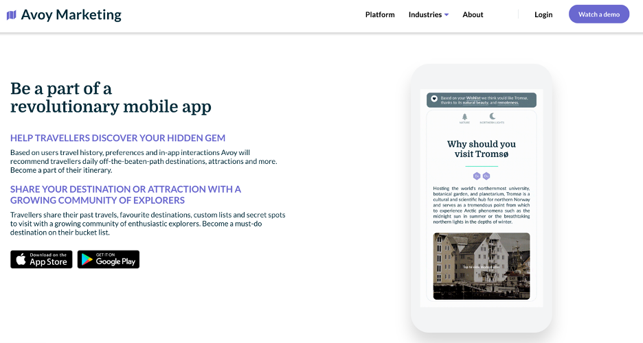
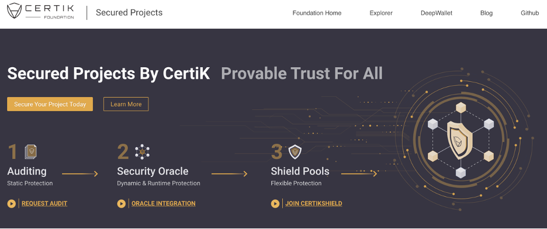
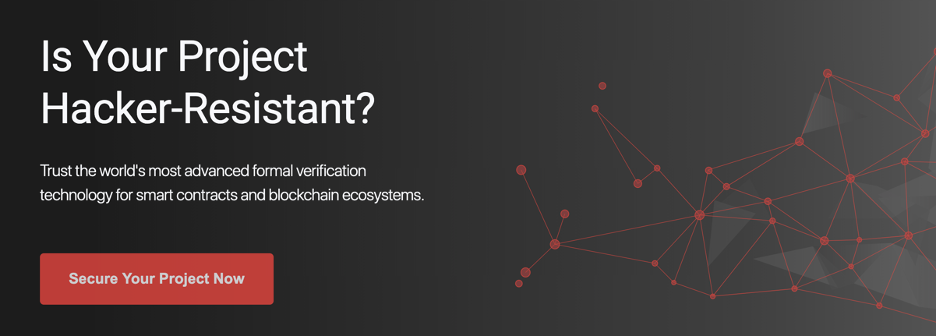
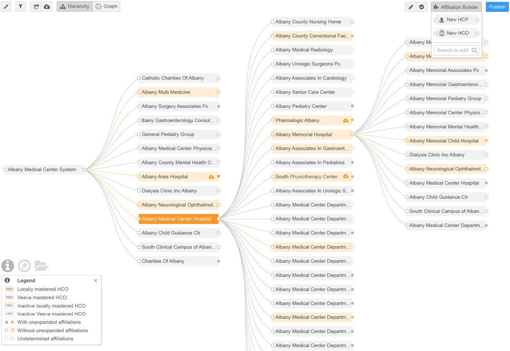
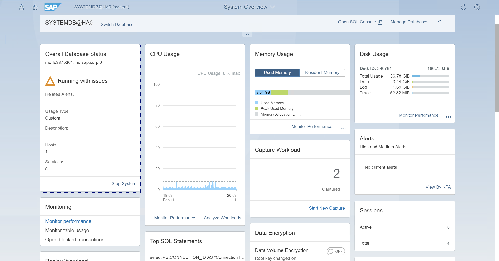
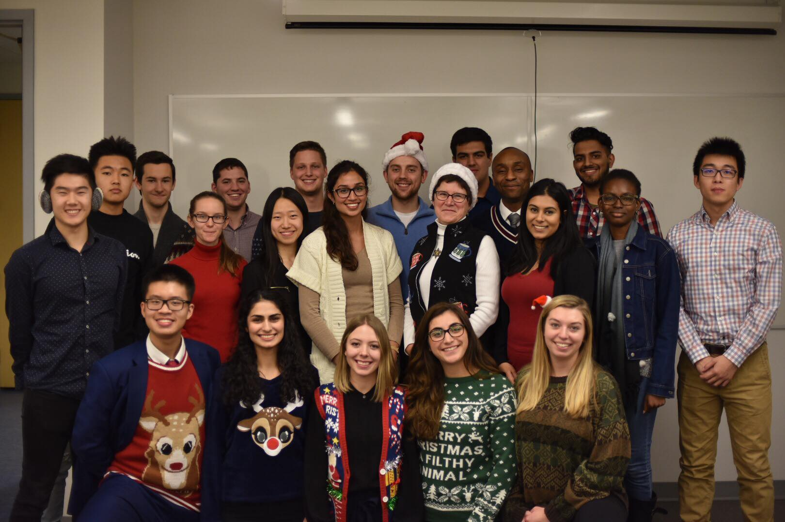

Hi!

I'm from Waterloo and am an aspiring product leader. Please check out my work, projects, and blogs respectively! Please check out my [resume!](https://drive.google.com/file/d/11OWM3LlUAfQQyrUg7pVngqHJA6Uwm-9e/view)

Additionally, you can learn more about my personal life at my [Notion Page!](https://www.notion.so/Seykafu-a8fda5021a274d82af74341b9a4a9f2e)

# My Work
## Product @ Avoy
I'm currently a product manager at Avoy, a travel-startup building out an ecosystem of applications and products for travellers and businesses around the world to find the best hidden gems and unbeaten destinations based on consumer preferences.
I'm currently the product lead for [Avoy Marketing](https://partners.avoy.io):
 

* I'm working with the CEO, engineers and designers to launch new data-driven features for travel influencers, marketing organizations, and ultimate end users. This includes:
    * Feature conceptualizations, drawing mockups and defining project scopes to Avoy's cross-functional team
    * Supporting the Avoy CEO with roadmap planning, feature ideation, and market intelligence research

* I'm constantly working with Destination Marketing Orgs (DMOs) to understand user needs and features to drive client revenue and performance.

* I'm also working internally with business development to drive client outreach and engagement to drive & sustain user acquisition

 

## Product Manager Intern @ CertiK
At Certik, I was part of several product teams; most notably the [CertiKShield](https://shield.certik.foundation/):

and [Auditing Portal](https://certik.io/):

* CertiKShield is designed to help decentralize converage for staking pool users who want to be covered for any potential loss in wallet crypto or their stake. Users can join pools and earn crypto from staking regularly while being simultaneously covered by paying a small monthly fee.

* I helped conceptualize, design and release the CertiKShield platform.
    * I worked alongside engineers, designers and the COO to research and validate feature viabilty and feasibility

    * Work ranged from brainstorming feature ideas, testing APIs, and illustrating wireframes to producing a actionable prototype for the engineering team.
    

* I also helped conceptualize and prepare the prelaunch of CertiK's auditing portal, designed to help support CertiK's auditing services in a more programmatic way.

* Along with my product-related projects, I supported the Marketing Team's efforts in launching their new chain marketing campaign, with the goal of acquiring new blockchain ambassadors, establishing partnership programs and streamlining marketing analytics for easier KPI analysis.

 

## Product Manager Intern @ Veeva Systems
At Veeva, I was part of [Veeva Network](https://www.veeva.com/resources/veeva-network-product-brief/), a master data management platform designed for large players in the life sciences and pharmaceutical space:

Specifically, I helped improve features for data versatility, data governance, and internal admin management:

* I helped conceptualize and craft a new iteration of Veeva's compliance data reporting tool, which is designed to both streamline data storage, extraction, downloading, and reporting, while also improving JSON formatting accuracy.

* I worked with the Director of PM to improve data availability in Veeva Network's SQL search tool, denoting data filtering labels, and researching product integration for FTP client data transferring. 

 

## Product Manager Intern @ SAP
SAP provided my my first product management internship! I worked primarily with senior product managers on the SAP HANA in-memory database, specifically the admin console, the [SAP HANA Cockpit](https://help.sap.com/viewer/product/SAP_HANA_COCKPIT/2.12.0.0/en-US):
 

I eventually also worked on [SAP HANA Cloud](https://www.sap.com/canada/products/hana/cloud.html). I helped the HANA Cloud team with performing market analysis and competitive intelligence on other cloud platform service providers. Conducting environmental analyses with various tools and frameworks, I crafted a roadmap strategy for the HANA Cloud admin console, the platform allowing users to configure access control, security, IAM, and cloud deployment settings.

 

## Consulting and Analytics Intern @ Precima

At Precima, I primarily worked on a data snapshot comparison and subsequent Excel analysis project for clients in the retail and commerce space.

Here are some of my achievements in-depth:
1. Optimized client revenue potential by 10% by first defining data and project requirements and communicating with client-facing team.

2. Next, I commensed the data standardization project in SQL and Shell Scripts by running 50+ SQL queries to build the proper tables necessary on AWS RedShift, with the key focus on determining significant differences in 6-month snapshots.

3. Finally, the end deliverable comprised of generated data insights from the un-wrangled client data via QlikView, Excel Tables and other visualizations.

  

# My Projects/Hackathons
## Shenkii - Side Project
Shenkii 
[Main Website](https://shenkii.com/) 

[Official HackMD Whitepaper](https://hackmd.io/@teamshenkii/rJkW5u96L) 

[GitHub](https://github.com/seykafu/Shenkii)

## Aweare
[DevPost Link](https://devpost.com/software/aweare-1i8ko2) 

[Github](https://github.com/seykafu/aweare) 

## Snapp
[DevPost Link](https://devpost.com/software/snapp-vctpoz) 

[GitHub](https://github.com/seykafu/snapp) 

## giftXChange
[DevPost Link](https://devpost.com/software/giftxchange-starterhacks-2019)

[Github](https://github.com/seykafu/starterhacks2019) 

## DriveMAS
[DevPost Link](https://devpost.com/software/drivemas) 

[Github](https://github.com/seykafu/DriveMAS) 

# My Leadership Activities
## Watsolve Consulting Group
Watsolve is a pro bono and student-led consulting group established by Dr. Okey Igboeli at the University of Waterloo.

As part of Watsolve, I began my journey as an associate, and ended my journey as a project lead. Here are my achievements:

* I Led a 3-person consulting team on 4-month project from May - Aug 2018 for a startup client based in Waterloo, working on revenue optimization, product market fit, investor outreach and internal organizational structure.

* I faciliated weekly client presentations to establish milestones, provide updates on project work, prevent roadblocks, and ultimately amplify relationships, resulting in the client expressing interest in a continuous contract.

## Podcast Lead @ UW PM
<html>
<body>
<iframe src="https://open.spotify.com/embed-podcast/show/4bjMhUJIKYlAl0nCjQCqGv" width="100%" height="232" frameborder="0" allowtransparency="true" allow="encrypted-media"></iframe>
</body>
</html>

## VP People @ UW Blueprint

# Contact
[Email](mailto:kaseyfuwaterloo@gmail.com)

Phone: 519-801-7135

# Here are my other profiles!
[Medium](https://medium.com/@seykafu!)

[Devpost](https://devpost.com/seykafu)

[Twitter](https://twitter.com/Seykafu)
